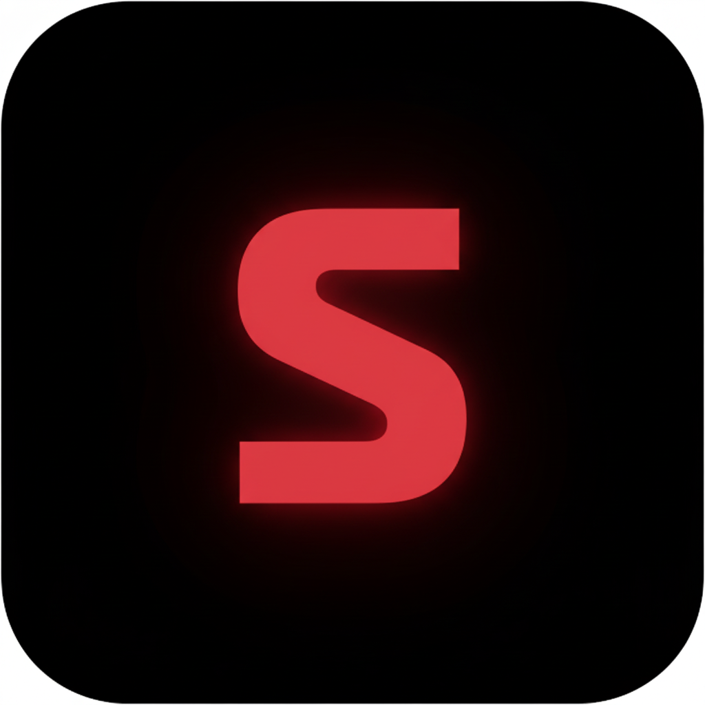

<p align="center">
  
</p>

<h1 align="center">  SHNWAZX Portfolio  </h1>

<p align="center">
  <strong>Creative Developer • Music Producer • Digital Artist</strong>
</p>

<p align="center">
  <a href="https://instagram.com/shnwazxc"></a>
  <a href="https://github.com/SHNWAZX"></a>
  <a href="https://www.youtube.com/@SHNWAZXC"></a>
  <a href="https://t.me/SHNWAZX"></a>
</p>

<p align="center">
  
  
  
  
  
</p>

---

## ⚡ About

A sleek, modern portfolio website showcasing my work as a creative developer, music producer, and digital artist. Built with cutting-edge web technologies and designed with a bold, dark aesthetic.

## 🛠️ Tech Stack

| Category | Technologies |
|----------|-------------|
| **Frontend** | React, TypeScript, Tailwind CSS |
| **Build Tool** | Vite |
| **UI Components** | shadcn/ui, Radix UI |
| **Backend** | Supabase (Database, Auth, Storage) |
| **Styling** | Custom design system with CSS variables |
| **Fonts** | Bebas Neue, Inter |

## ✨ Features

- 🎨 **Bold Dark Theme** - Eye-catching design with red accent colors
- 📱 **PWA Support** - Install as a native app on any device
- 🔒 **Source Protection** - Anti-inspect and copy protection measures
- 🎵 **Music Showcase** - Integrated music player section
- 💼 **Portfolio Gallery** - Dynamic project showcase
- 📧 **Contact Form** - Easy way to get in touch
- 🚀 **Smooth Animations** - Scroll-based animations and transitions

## 🚀 Quick Start

```bash
# Clone the repository
git clone <YOUR_GIT_URL>

# Navigate to project directory
cd <YOUR_PROJECT_NAME>

# Install dependencies
npm install

# Start development server
npm run dev
```

## 📁 Project Structure

```
src/
├── components/     # Reusable UI components
├── pages/          # Page components
├── hooks/          # Custom React hooks
├── assets/         # Images and static files
├── lib/            # Utility functions
└── integrations/   # Supabase client setup
```

## 🔐 Security Features

This portfolio includes several protection measures:
- Right-click disabled
- Keyboard shortcuts blocked (F12, Ctrl+U, etc.)
- Text selection disabled
- DevTools detection
- Console warnings for curious developers 😈

## 📜 License

© 2024 SHNWAZX. All rights reserved.

---

<p align="center">
  <strong>🔥 GO TO HELL if you try to steal this code 🔥</strong>
</p>

<p align="center">
  Made with ❤️ by <a href="https://github.com/SHNWAZX">SHNWAZX</a>
</p>
